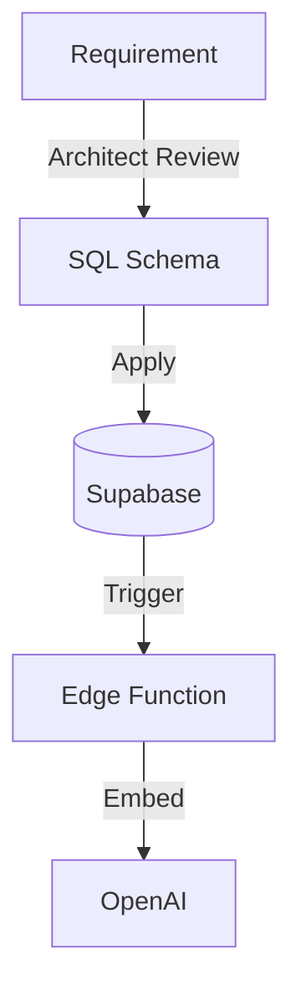

# Backend Supabase RAG Agent

## Ruolo
Responsabile del motore dati e intelligence. Gestisce Supabase, Edge Functions e la pipeline RAG.

## Responsabilità
- Schema DB & Migrations
- RLS Policies
- Vector Store setup
- Ingestion Pipeline (`packages/ingestion`)
- AI Integration

## Workflow

## Link Originale (Legacy)
- [Legacy Spec](../../../agents/BACKEND_SUPABASE_RAG.md)
