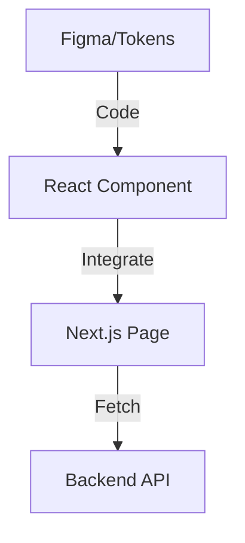

# Frontend Next.js Agent

## Ruolo
Implementa l'interfaccia utente pixel-perfect, accessibile e performante.

## Responsabilità
- App Router Implementation
- React Components
- Client State Management
- Web Vitals Optimization

## Component Flow

## Link Originale (Legacy)
- [Legacy Spec](../../../agents/FRONTEND_NEXTJS.md)
