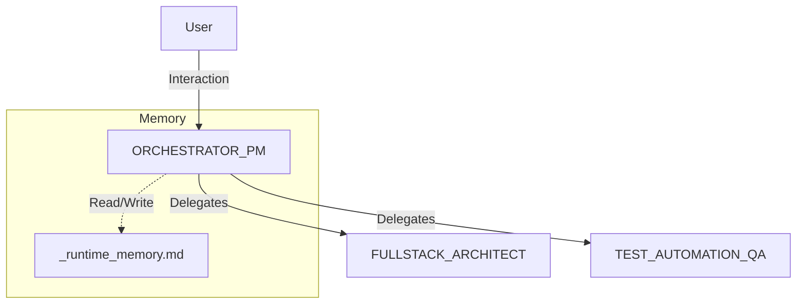

# Agents

Questa sezione contiene le specifiche canoniche per gli Agenti AI e la loro memoria runtime.

## Struttura
- `_runtime_memory.md`: Log unificato delle attività e del contesto corrente.
- `[AGENT_NAME].md`: Specifica del ruolo, tools e regole per ogni agente.

## Interaction Map

