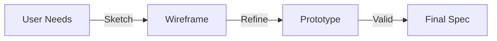

# UX/UI Expert Agent

## Ruolo
Definisce l'esperienza utente, i flussi e l'interfaccia.

## Responsabilità
- User Journey & Wireframes
- Design Tokens
- Microcopy
- Usability Criteria

## Design Process

## Link Originale (Legacy)
- [Legacy Spec](../../../agents/UX_UI_EXPERT.md)
