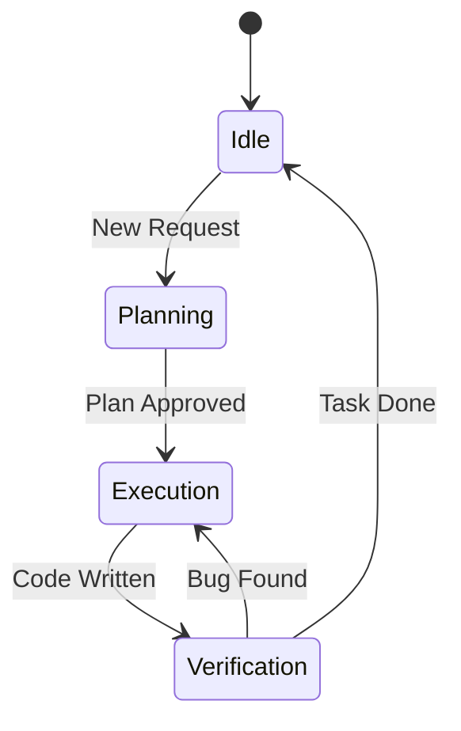

# Agent Runtime Memory

Questo file funge da "memoria a breve termine" condivisa per tutti gli agenti attivi.
Qui vengono registrati i progressi dei task correnti, i blocchi e le note volatili.

## Memory Flow

## Current Context
- **Active Task**: Memory Bank Optimization
- **Phase**: Structure & Canonization
- **Last Action**: Created canonical Agent specs.

## Task History (Last 5)
- **v0.10.2**: (DEV_TOOLS) Added run_server global command.
- **v0.10.1**: (DEV_SNAPSHOT) Update pilot-web and add validation script.
- **v0.10.0**: (MB_V2_UPGRADE) Upgrade to Memory Bank v2.
