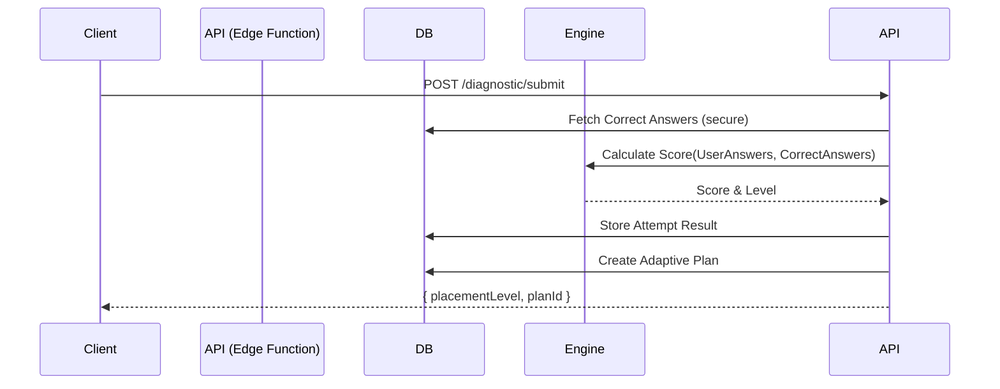

# API Contracts V2

Contratti standard per l'interazione tra Frontend (Next.js) e Learning Engine (Supabase Edge Functions).

## Principles
- **Strict Typing**: Tutti i payload JSON devono rispettare le interfacce TypeScript.
- **Idempotency**: Le operazioni di submit devono essere sicure se ripetute (es. retry rete).
- **Secure by Design**: Nessuna manipolazione diretta di score dal client. Il calcolo avviene server-side.

## 1. Diagnostic Flow

### `POST /api/diagnostic/start`
Inizia una nuova sessione diagnostica per un corso.

**Request**
```json
{
  "courseId": "uuid"
}
```

**Response (200 OK)**
```json
{
  "attemptId": "uuid",
  "assessmentId": "uuid",
  "questions": [
    {
      "id": "uuid",
      "prompt": "Che cos'è...",
      "options": [
        { "id": "uuid", "label": "Opzione A" }
      ]
    }
  ]
}
```

### `POST /api/diagnostic/submit`
Invia tutte le risposte (o parziali) per il calcolo.

**Request**
```json
{
  "attemptId": "uuid",
  "answers": [
    { "questionId": "uuid", "selectedOptionId": "uuid" }
  ]
}
```

**Response (200 OK)**
```json
{
  "placementLevel": "Novice | Beginner | Intermediate | Advanced",
  "score": 85.5,
  "planId": "uuid",
  "nextAction": "/dashboard"
}
```

## 2. Adaptive Plan & Progress

### `GET /api/plan/current`
Recupera il piano di studi attivo.

**Query Params**: `courseId=uuid`

**Response (200 OK)**
```json
{
  "planId": "uuid",
  "status": "active",
  "level": "Beginner",
  "items": [
    {
      "id": "uuid",
      "moduleId": "uuid",
      "moduleTitle": "Fonti del Diritto",
      "status": "completed",
      "type": "core"
    },
    {
      "id": "uuid",
      "moduleId": "uuid",
      "moduleTitle": "Contratti",
      "status": "locked",
      "type": "core"
    }
  ]
}
```

### `GET /api/progress`
Recupera lo stato dettagliato dei moduli.

**Response (200 OK)**
```json
{
  "modules": [
    {
      "moduleId": "uuid",
      "status": "available",
      "progressPercent": 0,
      "lastScore": null
    }
  ]
}
```

## 3. Module Quiz (Formative)

### `POST /api/module/quiz/submit`
Invia risposte per un quiz di un modulo specifico.

**Request**
```json
{
  "moduleId": "uuid",
  "attemptId": "uuid",
  "answers": [...]
}
```

**Response (200 OK)**
```json
{
  "passed": true,
  "score": 90,
  "feedback": "Ottimo lavoro...",
  "unlockedModuleId": "uuid", // Se passato
  "remedialContent": null // Se fallito
}
```

## Sequence Diagram: Diagnostic

