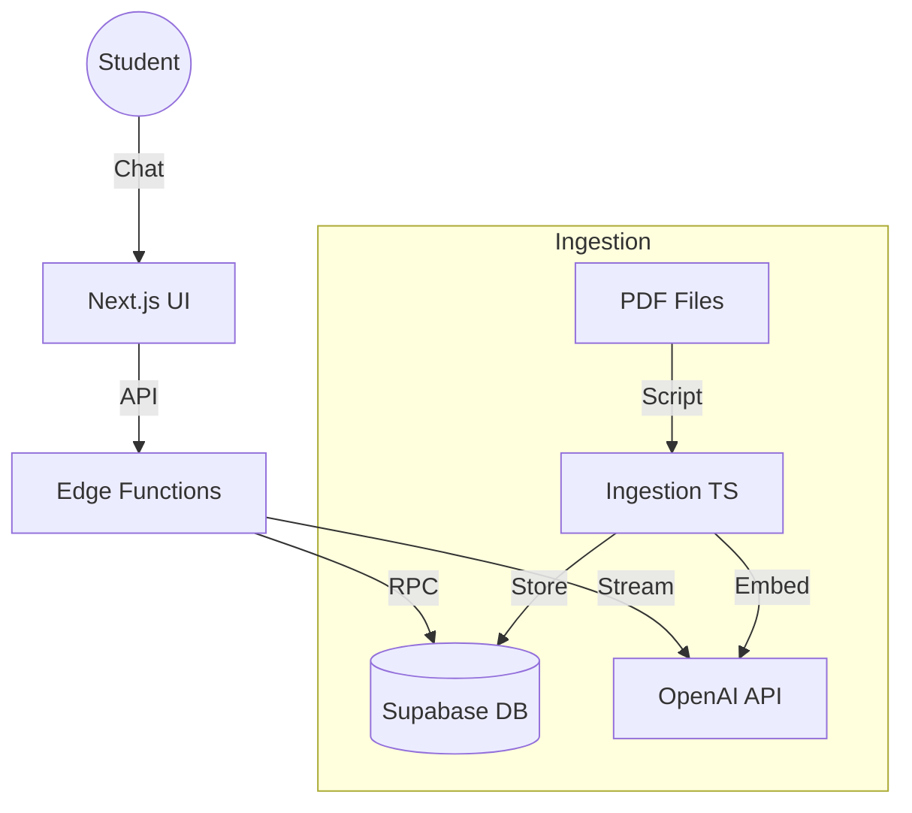

# Current Architecture

### Component Diagram

## Overview
## System Overview
"Le Università" MVP is a RAG-based (Retrieval-Augmented Generation) application designed to assist students with university-related queries. It leverages a modern stack centered around Supabase for data & logic and OpenAI for intelligence.

## Core Components

### 1. Ingestion Engine (`packages/ingestion`)
- **Responsibility**: Converts raw PDFs into knowledge chunks.
- **Process**: 
  - Parsing (PDF -> Text)
  - Chunking (Split by semantics/tokens)
  - Embedding (OpenAI `text-embedding-3-small`)
  - Storage (Supabase `documents` table + `pgvector`)

### 2. Knowledge Base (Supabase)
- **Database**: Postgres with `pgvector` extension.
- **Tables**:
  - `documents`: Stores text chunks, embeddings, and metadata.
  - `sources`: Tracks original documents (e.g., PDF filenames, URLs).

### 3. Reasoning Engine (Supabase Edge Functions)
- **Function**: `supabase/functions/chat`
- **Logic**:
  - Receives user query.
  - Generates query embedding.
  - Performs similarity search (RPC call).
  - Constructs prompt with context.
  - Streams OpenAI response to client.

### 4. User Interface (Planned)
- **Tech**: Next.js (React)
- **Features**: Chat interface, source citation view, user authentication.

## Component Diagram
Refer to `diagrams/release_vX.Y.Z.mmd` for the latest view.
