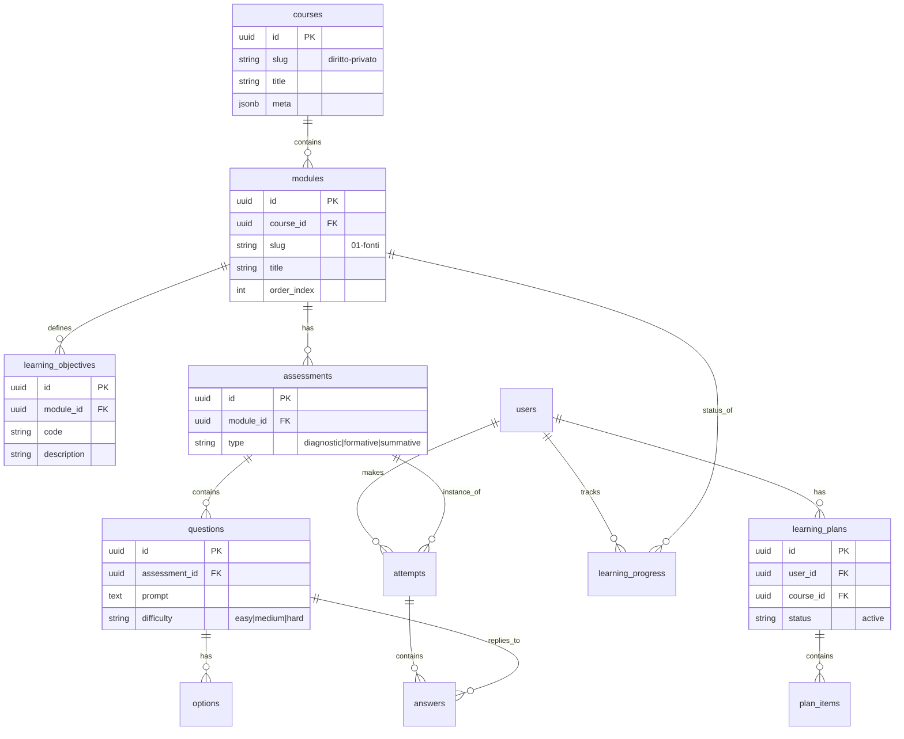

# Database Schema V2

Schema database per il Learning Engine (v2), progettato per supportare Catalog Content, Adaptive Tracking e RLS rigorosa.

## Analisi Stato Precedente
- **V1 (Diagnostic)**: Tabelle `diagnostic_attempts` con domande generate on-the-fly (`diagnostic_questions` linkata a `attempt`).
- **Problema V1**: Mancanza di un catalogo "statico" o "semi-statico" delle domande validata. Difficile tracciare progressione su moduli specifici.
- **Strategia V2**: Introdotta separazione netta tra **Catalogo** (Corsi, Moduli, Domande Pool) e **Tracking** (Tentativi, Risposte, Progressi).

## ER Diagram (V2)

## Tables Definition

### 1. Catalog Domain (Public Read)
Dati strutturati del corso. RLS: Public Read, Admin Write.

**`courses`**
- `id` (uuid, PK)
- `slug` (text, unique) - es. 'diritto-privato'
- `title` (text)
- `description` (text)

**`modules`**
- `id` (uuid, PK)
- `course_id` (uuid, FK)
- `slug` (text) - es. '01-fonti'
- `title` (text)
- `server_id` (text, unique) - ID logico stabile (es. 'MOD-PRIV-01')

**`learning_objectives`**
- `id` (uuid, PK)
- `module_id` (uuid, FK)
- `text` (text)
- `kpi_ref` (text) - Link al KPI

**`assessments` (Pool)**
- `id` (uuid, PK)
- `module_id` (uuid, FK nullable) - Null se è global (es. Diagnostic Corso)
- `type` (text) - 'diagnostic', 'formative', 'summative'
- `settings` (jsonb) - Time limit, passing score

**`questions` (Pool)**
- `id` (uuid, PK)
- `assessment_id` (uuid, FK)
- `prompt` (text)
- `difficulty` (int) - 1..5
- `explanation` (text) - Feedback per l'errore

**`question_options`**
- `id` (uuid, PK)
- `question_id` (uuid, FK)
- `label` (text)
- `is_correct` (bool) - **Security**: Escludere dalle select public se possibile, o gestire via Edge Function.

### 2. Tracking Domain (User Write/Read)
Dati di progresso. RLS: Owner Only.

**`learning_progress_v2`**
- `id` (uuid, PK)
- `user_id` (uuid, default auth.uid())
- `course_id` (uuid, FK)
- `module_id` (uuid, FK)
- `status` (text) - 'locked', 'available', 'completed', 'mastered'
- `current_unit_index` (int)
- `updated_at` (ts)

**`learning_attempts`**
- `id` (uuid, PK)
- `user_id` (uuid)
- `assessment_id` (uuid, FK)
- `status` (text) - 'in-progress', 'completed'
- `score` (float)
- `started_at` (ts)
- `completed_at` (ts)

**`learning_answers`**
- `id` (uuid, PK)
- `attempt_id` (uuid, FK)
- `question_id` (uuid, FK)
- `selected_option_id` (uuid, nullable)
- `text_answer` (text, nullable)
- `is_correct` (bool)

### 3. Adaptive Domain
Il piano di studi generato.

**`learning_plans`**
- `id` (uuid, PK)
- `user_id` (uuid)
- `course_id` (uuid, FK)
- `level` (text) - 'novice', 'beginner', ...

**`plan_items`**
- `id` (uuid, PK)
- `plan_id` (uuid, FK)
- `module_id` (uuid, FK)
- `status` (text) - 'todo', 'done', 'skipped'
- `type` (text) - 'core', 'reinforcement'
