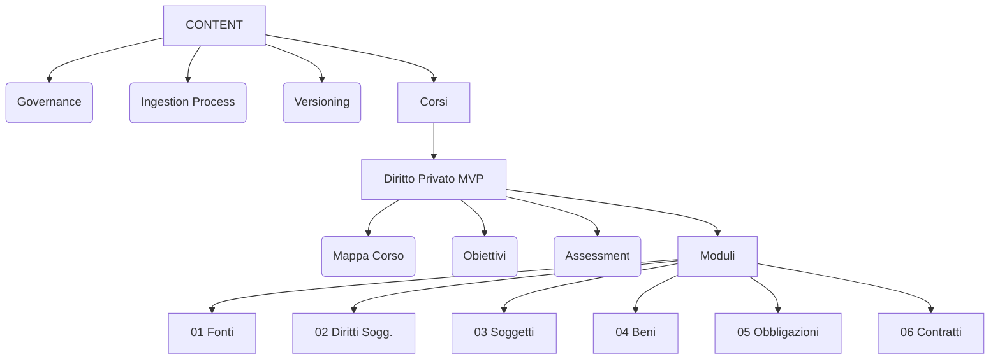

# Content Memory Bank

Single Source of Truth per l'organizzazione, governance e struttura dei contenuti didattici.

## Scopo
- Definire **COSA** insegniamo (Struttura Corsi).
- Definire **COME** lo creiamo (Governance & Ingestion).
- Definire **DOVE** finisce (Mapping su Product).

**NON contiene**:
- Appunti sparsi o non revisionati.
- Copie integrali di testi coperti da copyright (solo sintesi originali).

## Product Alignment
I contenuti sono strutturati per supportare gli obiettivi dell'MVP e i KPI di apprendimento.
- **Scope**: Vedi [MVP Scope](../PRODUCT/mvp_scope.md) (Solo Diritto Privato).
- **Successo**: Vedi [KPI](../PRODUCT/kpi.md) (Completion Rate & Accuracy).

## Mappa Contenuti

## Indice Core
| File | Scopo |
|------|-------|
| [`governance.md`](./governance.md) | Regole su copyright, fonti e stile. |
| [`ingestion_process.md`](./ingestion_process.md) | Workflow da PDF grezzo a Oggetto Didattico. |
| [`versioning.md`](./versioning.md) | Ciclo di vita dei contenuti (Draft -> Live -> Deprecated). |

## Corsi Attivi
| Corso | Stato | Link |
|-------|-------|------|
| **Diritto Privato** | MVP Pilot | [Vai al Corso](./courses/diritto_privato/README.md) |
