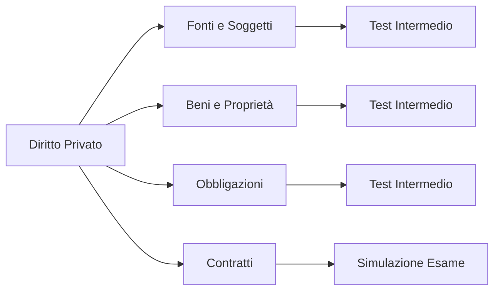

# Diritto Privato (MVP)

Il corso pilota per il lancio di "Le Università". Copre i fondamenti essenziali richiesti al primo anno di Giurisprudenza.

## Scheda Corso
- **Livello**: Universitario (LMG-01)
- **Durata Stimata**: 12 Settimane
- **Obiettivo**: Superamento esame istituzionale.
- **Riferimento**: Manuali standard (es. Torrente-Schlesinger, Trabucchi - *riferimenti concettuali*).

## Product Alignment
Questo corso implementa l'ambito definito in [MVP Scope](../../../PRODUCT/mvp_scope.md).
Obiettivo KPI: Portare lo studente a completare i 6 moduli con accuratezza > 70%.

## Struttura Macro

