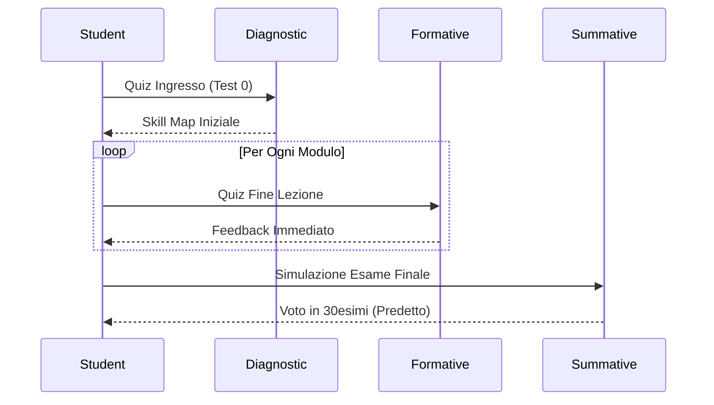

# Assessment Model

Come valutiamo la preparazione dello studente.

## Flusso di Valutazione

## Tipologie Test
1.  **Diagnostico**: 30 domande a risposta multipla, copre tutto il programma in modo superficiale. Identifica lacune macro.
2.  **Formativo**: Domande specifiche post-topic. Serve a fissare i concetti. Errore = Spiegazione immediata.
3.  **Sommativo**: Simulazione reale. Tempo limitato, niente aiuti.
