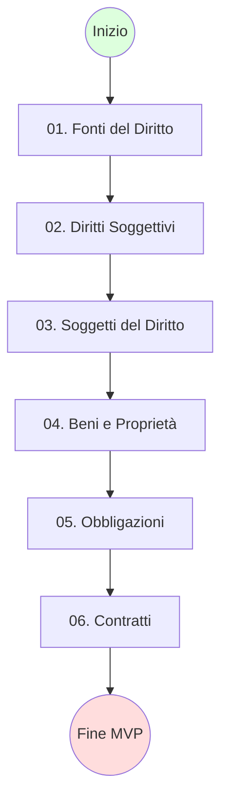

# Course Map: Diritto Privato

Progressione logica degli argomenti.

## Learning Path

## Prerequisiti
- **02. Diritti Soggettivi** richiede concetti di *Capacità Giuridica* (03). (Nota: Spesso studiati in parallelo).
- **06. Contratti** richiede padronanza assoluta di **05. Obbligazioni**.
