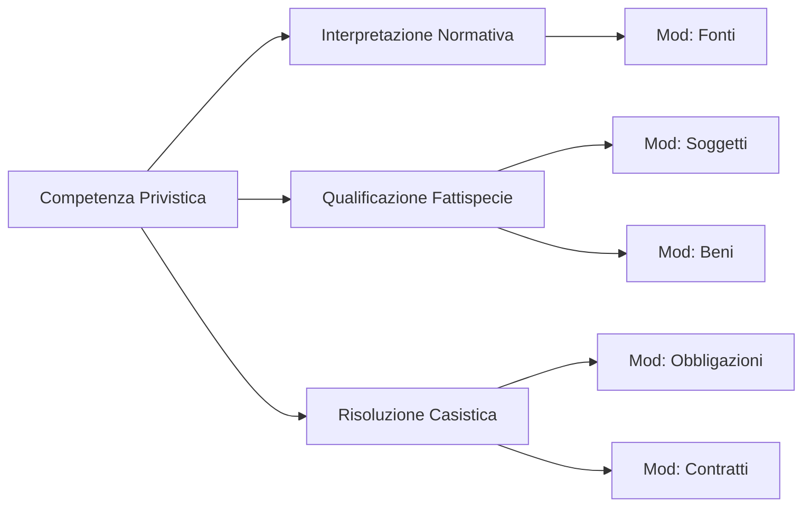

# Learning Objectives (LO)

Competenze che lo studente deve acquisire, mappate sui moduli.

## Objectives Tree

## Tabella Competenze
| Modulo | Obiettivo (LO) | KPI Correlato |
|--------|----------------|---------------|
| **01. Fonti** | Distinguere gerarchia delle fonti. | % Accuratezza Quiz Gerarchia |
| **05. Obbligazioni** | Identificare elementi costitutivi obbligazione. | % Accuratezza Casi Pratici |
| **06. Contratti** | Riconoscere nullità vs annullabilità. | % Successo Simulazione Esame |
