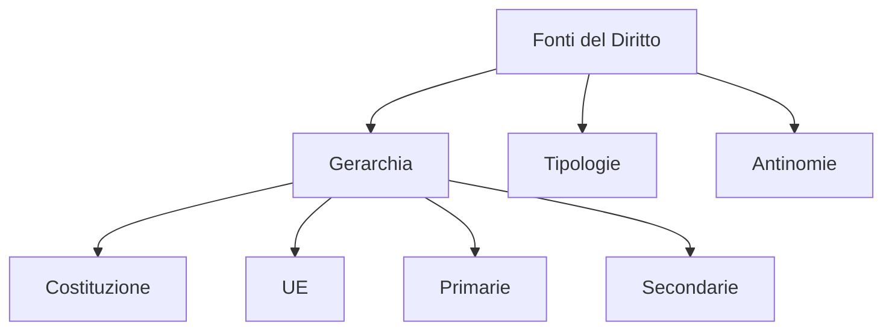

# Modulo 01: Fonti del Diritto

## Scopo
Comprendere da dove nasce la norma giuridica e come le norme si coordinano tra loro (gerarchia).

## Concetti Chiave
- Costituzione e Leggi Costituzionali.
- Fonti Comunitarie (Regolamenti/Direttive UE).
- Leggi Ordinarie / Decreti Legge / Decreti Legislativi.
- Regolamenti e Usi.
- Criterio Gerarchico, Cronologico e di Specialità.

## Structure Map

