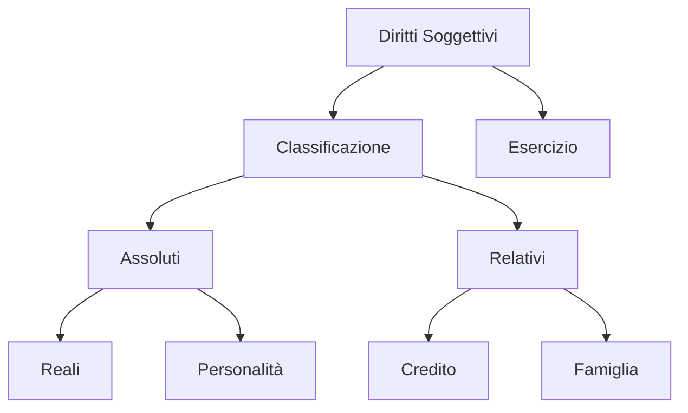

# Modulo 02: Diritti Soggettivi

## Scopo
Analizzare il potere conferito dall'ordinamento al soggetto per il soddisfacimento di un interesse tutelato.

## Concetti Chiave
- Diritto Oggettivo vs Soggettivo.
- Diritti Assoluti vs Relativi.
- Potestà, Facoltà, Aspettativa.
- Interesse Legittimo.
- Abuso del Diritto.

## Structure Map

