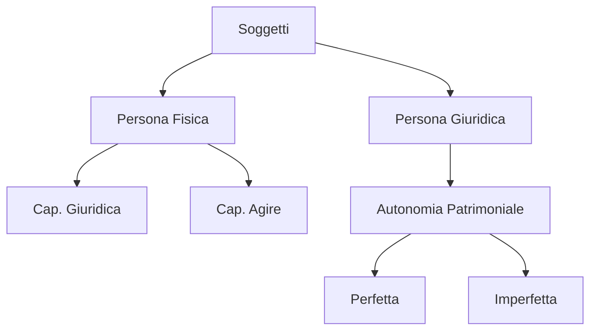

# Modulo 03: Soggetti di Diritto

## Scopo
Identificare chi sono i protagonisti dell'ordinamento giuridico e le loro capacità.

## Concetti Chiave
- Persone Fisiche vs Giuridiche.
- Capacità Giuridica (Nascita).
- Capacità di Agire (18 anni).
- Incapacità (Minore, Interdetto, Inabilitato).
- Amministrazione di Sostegno.
- Enti (Associazioni, Fondazioni, Comitati).

## Structure Map

