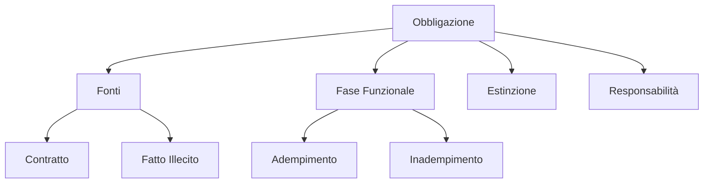

# Modulo 05: Obbligazioni

## Scopo
Il rapporto obbligatorio: debitore, creditore e prestazione.

## Concetti Chiave
- Fonti delle obbligazioni (Art. 1173 c.c.).
- Adempimento e Inadempimento.
- Mora del debitore e del creditore.
- Modi di estinzione diversi dall'adempimento.
- Responsabilità Patrimoniale (Art. 2740 c.c.).

## Structure Map

