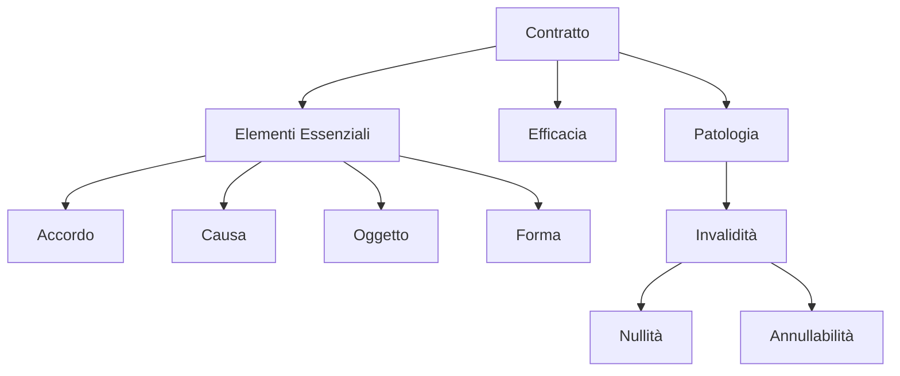

# Modulo 06: Contratti

## Scopo
L'accordo tra le parti per costituire, regolare o estinguere un rapporto giuridico patrimoniale.

## Concetti Chiave
- Autonomia Contrattuale (1322 c.c.).
- Elementi Essenziali (Accordo, Causa, Oggetto, Forma).
- Elementi Accidentali (Condizione, Termine, Modo).
- Patologia: Nullità vs Annullabilità.
- Risoluzione e Rescissione.

## Structure Map

