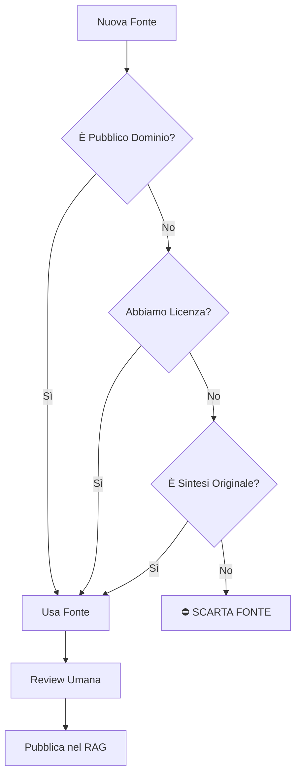

# Content Governance Policy

Regole inderogabili per la creazione e gestione dei contenuti.

## 1. Fonti Ammesse
- **Open Access**: Testi di legge (Gazzetta Ufficiale), Sentenze pubbliche.
- **Rielaborazioni Originali**: Sintesi prodotte internamente o dall'AI su nostra direttiva.
- **Materiale Partner**: Fornito esplicitamente dall'ateneo con licenza d'uso.

## 2. Divieti Assoluti
- ❌ Upload di manuali interi senza licenza.
- ❌ Copia-incolla massivo da siti terzi non autorizzati.
- ❌ Generazione AI non verificata da umano (Human-in-the-loop obbligatorio).

## 3. Regole RAG Publishing
Nel database vettoriale (RAG) finiscono SOLO contenuti "Safe":
- Testi di legge e sentenze (Pubblico Dominio).
- Sintesi originali prodotte da noi (Nostra proprietà).
- **NON** viene indicizzato testo grezzo di libri protetti da copyright, a meno di specifico accordo scritto.

## Decision Flow

