# Content Ingestion Workflow

Come trasformiamo una fonte grezza in conoscenza strutturata per la piattaforma.

## Pipeline
1.  **Source Acquisition**: Raccolta PDF/Text.
2.  **Preprocessing**: Pulizia, chunking semantico.
3.  **Enrichment**: Tagging automatico (Topic, Difficoltà).
4.  **Embedding**: Vettorializzazione per RAG.
5.  **Assessment Gen**: Creazione quiz correlati.

## Workflow Grafico

```mermaid
flowchart LR
    RAW[📄 PDF Fonte] --> CLEAN[🧹 Preprocessing]
    CLEAN --> CHUNK[✂️ Chunking]
    
    CHUNK --> AI_TAG[🤖 AI Tagging]
    CHUNK --> VECTOR[🧮 Embedding]
    
    AI_TAG --> DB[(Supabase DB)]
    VECTOR --> DB
    
    DB --> QUIZ_GEN[❓ Quiz Generation]
    QUIZ_GEN --> REVIEW[👀 Human Review]
    REVIEW --> LIVE[🚀 LIVE]
```

## Sequence

