# Content Ingestion Workflow

Come trasformiamo una fonte grezza in conoscenza strutturata per la piattaforma.

## Governance & Compliance
Prima di qualsiasi ingestione tecnica, DEVE essere soddisfatto il **Compliance Gate**.
I contenuti devono essere:
1.  Pubblico Dominio (es. Sentenze, Codici).
2.  Oppure Open Access (CC-BY).
3.  Oppure Sintesi Originali create internamente.
*Vietata l'ingestione indiscriminata di manuali coperti da copyright.*

## Pipeline
1.  **Compliance Check**: Verifica legale della fonte.
2.  **Source Acquisition**: Raccolta PDF/Text.
3.  **Preprocessing**: Pulizia, chunking semantico.
4.  **Enrichment**: Tagging automatico (Topic, Difficoltà).
5.  **Embedding**: Vettorializzazione per RAG.
6.  **Assessment Gen**: Creazione quiz correlati.

## Workflow Grafico

```mermaid
flowchart LR
    RAW[📄 PDF Fonte] --> COMPLIANCE{Compliance Gate}
    
    COMPLIANCE -- OK --> CLEAN[🧹 Preprocessing]
    COMPLIANCE -- NO --> REJECT[⛔ Scarta / Solo Metadata]
    
    CLEAN --> CHUNK[✂️ Chunking]
    
    CHUNK --> AI_TAG[🤖 AI Tagging]
    CHUNK --> VECTOR[🧮 Embedding]
    
    AI_TAG --> DB[(Supabase DB)]
    VECTOR --> DB
    
    DB --> QUIZ_GEN[❓ Quiz Generation]
    QUIZ_GEN --> REVIEW[👀 Human Review]
    REVIEW --> LIVE[🚀 LIVE]
```

## Sequence

