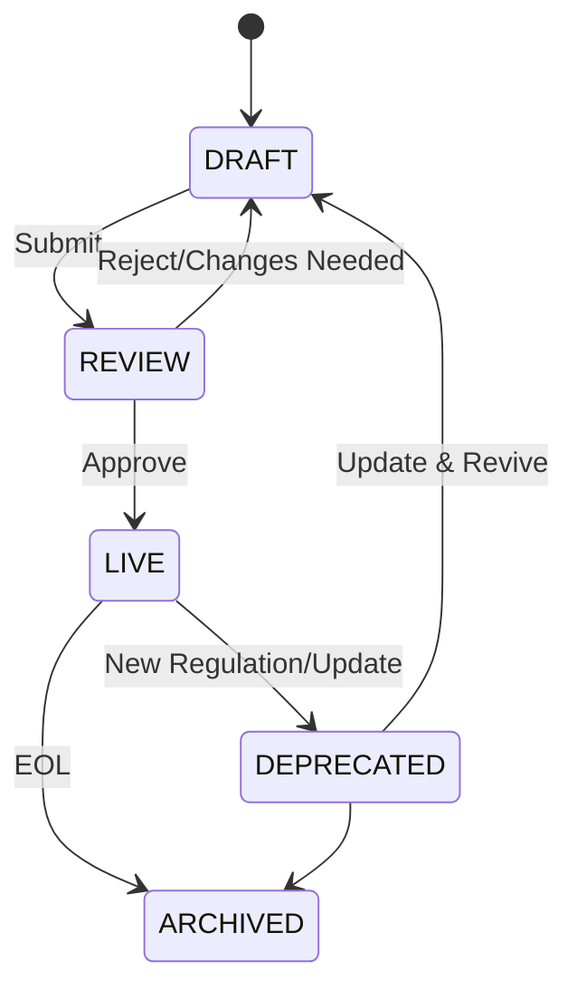

# Content Versioning Lifecycle

I contenuti non sono statici. La legge cambia, i metodi di insegnamento evolvono.

## Stati del Contenuto
1.  **DRAFT**: In lavorazione, visibile solo agli editor.
2.  **REVIEW**: In attesa di approvazione legale/pedagogica.
3.  **LIVE**: Pubblicato e servito agli studenti.
4.  **DEPRECATED**: Non più valido (es. legge abrogata), mantenuto per storico.
5.  **ARCHIVED**: Rimosso dall'accesso attivo.

## Lifecycle Diagram

## Regole di Versionamento
- **Major Update (vX.0)**: Cambiamenti strutturali al corso o cambio normativa rilevante.
- **Minor Update (v0.X)**: Correzioni, aggiunta quiz, miglioramento spiegazioni.
- **Patch (v0.0.X)**: Fix typo.
