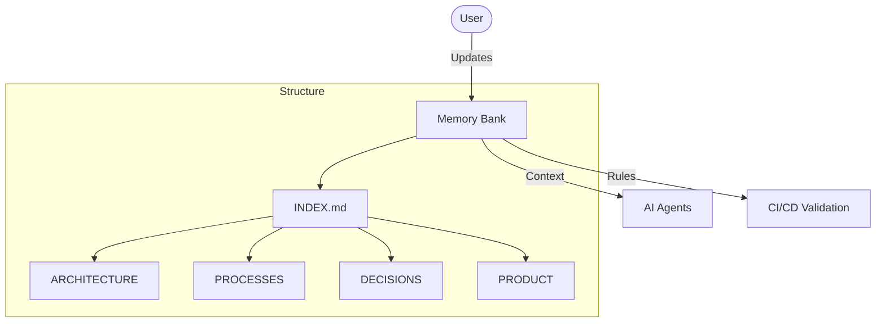

# Adozione Memory Bank v2

## Cosa
Formalizzazione della struttura `docs/memory_bank` come unica **Single Source of Truth** per il progetto. Introduzione di Mermaid diagram obbligatori e metadata YAML standard.

## Perché
La documentazione dispersa o puramente testuale diventa rapidamente obsoleta e difficile da navigare. I diagrammi architetturali e di processo sono essenziali per mantenere l'allineamento tra agenti e sviluppatori umani.

## Come
Ogni file deve risiedere in cartelle specifiche (`AGENTS`, `ARCHITECTURE`, `DECISIONS`, `PROCESSES`, `PRODUCT`, `CONTENT`) e seguire il template standard.

### Diagramma

## Output / Deliverables
- Cartella `docs/memory_bank` strutturata.
- Script di validazione in CI.
- Diagrammi navigabili su GitHub.
