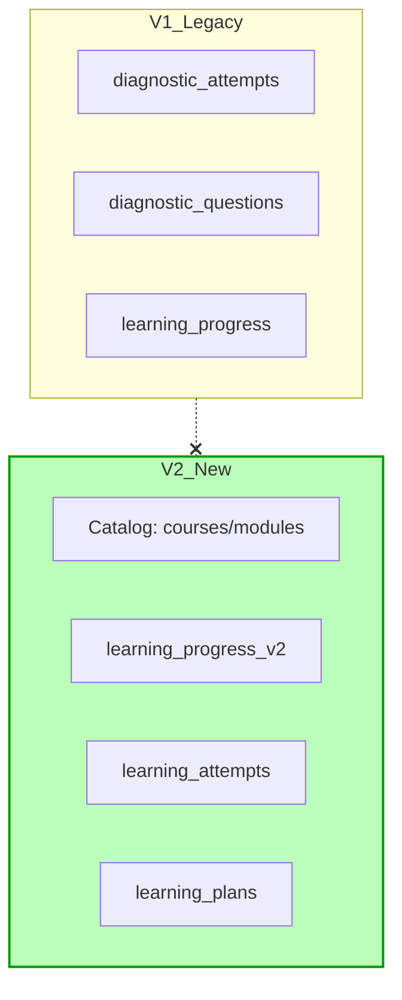

# Schema Strategy Visualization

```mermaid
graph TD
    subgraph V1_Legacy
        DA[diagnostic_attempts]
        DQ[diagnostic_questions]
        LP1[learning_progress]
    end
    
    subgraph V2_New
        CAT[Catalog: courses/modules]
        LP2[learning_progress_v2]
        LA[learning_attempts]
        PLAN[learning_plans]
    end
    
    V1_Legacy -.-x V2_New
    style V2_New fill:#bfb,stroke:#090,stroke-width:2px
```
