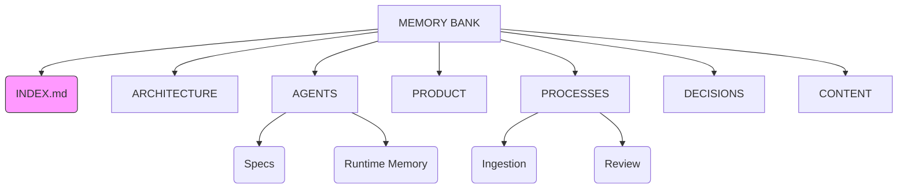

# Memory Bank (v2)

Questa cartella rappresenta la **Single Source of Truth** del progetto "Le Università".
Tutti i documenti qui contenuti sono "vivi" e devono riflettere lo stato corrente del sistema.

## Mappa Struttura

## Collegamenti Rapidi

| Sezione | Descrizione | Link |
|---------|-------------|------|
| **ARCHITECTURE** | Diagrammi e specifiche tecniche | [Architecture](./ARCHITECTURE/current.md) |
| **AGENTS** | Prompt e contesto per le AI | [Agents](./AGENTS/README.md) |
| **PROCESSES** | Come lavoriamo (workflow) | [Processes](./PROCESSES/ingestion.md) |
| **DECISIONS** | Registro decisioni (ADR) | [Decisions](./DECISIONS/ADR-000-memory-bank.md) |
| **PRODUCT** | Vision e requisiti | [Product](./PRODUCT/README.md) |
| **CONTENT** | Fonti e materiali | [Content](./CONTENT/README.md) |

## Changelog Recente
- **v0.11.1**: Ristrutturazione completa Memory Bank (Mermaid + Standard Template).
- **v0.1.3**: Consolidamento conoscenza iniziale.

## Ultima Revisione
**Data**: 2025-12-20
**Stato**: Optimization in progress
