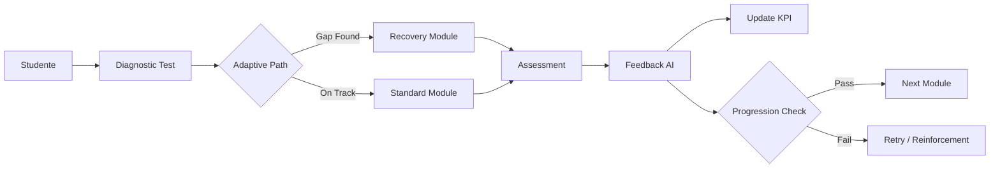

# Learning Engine Logic

Il "cervello didattico" della piattaforma. Definisce le regole che governano la progressione dello studente.

## Scopo
- Stabilire **COME** lo studente viene valutato.
- Definire **QUANDO** il percorso si adatta (Adaptive Learning).
- Tracciare il confine tra **Logica Deterministica** e **AI Generativa**.

## Relazioni Core
- **Input**: Contenuti strutturati da [CONTENT](../CONTENT/README.md).
- **Output**: Metriche di successo per [PRODUCT](../PRODUCT/kpi.md).

## High-Level Flow

## Indice Moduli
| File | Scopo |
|------|-------|
| [`diagnostic_model.md`](./diagnostic_model.md) | Logica del test d'ingresso e skill mapping. |
| [`adaptive_rules.md`](./adaptive_rules.md) | Regole IF/THEN per l'adattamento del percorso. |
| [`progression_logic.md`](./progression_logic.md) | Macchina a stati per l'avanzamento. |
| [`assessment_types.md`](./assessment_types.md) | Tassonomia delle valutazioni. |
| [`ai_role.md`](./ai_role.md) | Cosa fa (e non fa) l'AI. |
| [`data_model.md`](./data_model.md) | Modello concettuale dati studente/progressi. |
