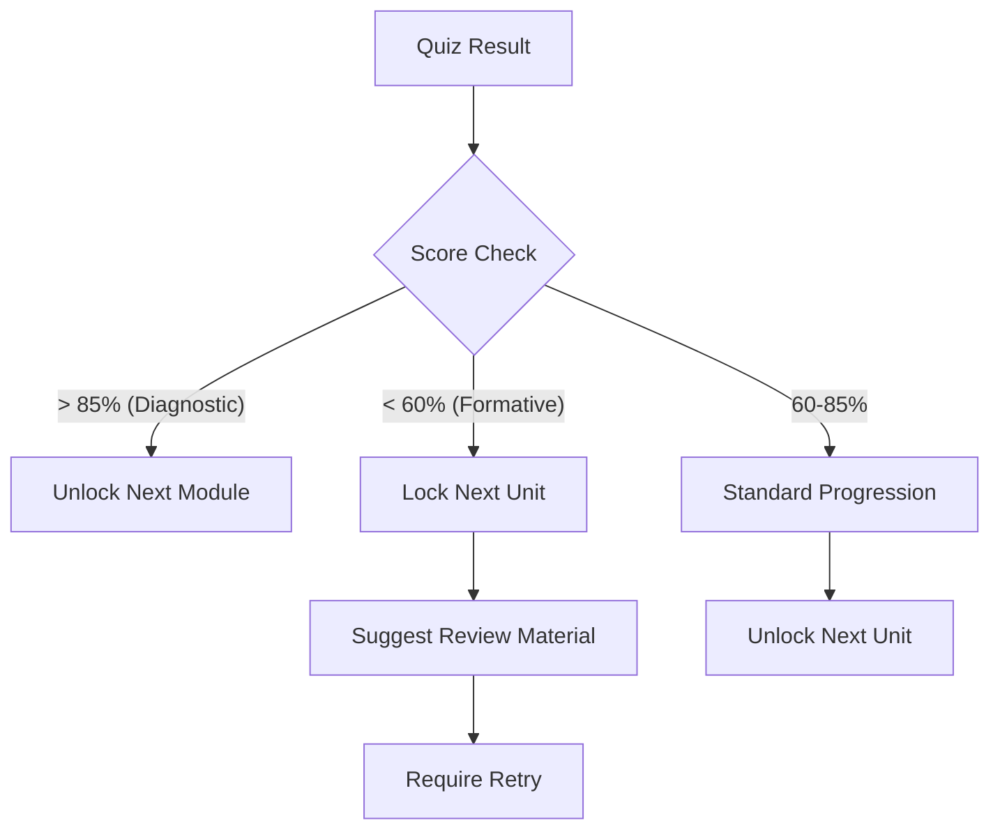

# Adaptive Rules Engine

Il motore decisionale che adatta il contenuto in base allo studente.

## Regole IF/THEN

### Rule 1: Module Skip (Fast Track)
- **IF** Diagnostic Score for Topic > 85%
- **THEN** Mark Module as "Optional/Completed"
- **AND** Unlock next Module immediately.

### Rule 2: Reinforcement Trigger
- **IF** Formative Quiz Score < 60%
- **THEN** Trigger "Reinforcement Loop"
- **AND** Suggest specific reading (chunk) related to the wrong answer.
- **AND** Lock next unit until retry > 70%.

### Rule 3: Difficulty Adjustment
- **IF** 3 consecutive answers are Correct (Streak)
- **THEN** Increase next question difficulty (Easy -> Medium).
- **IF** 2 consecutive answers are Wrong
- **THEN** Decrease next question difficulty (Hard -> Medium).

## Rule Flowchart

