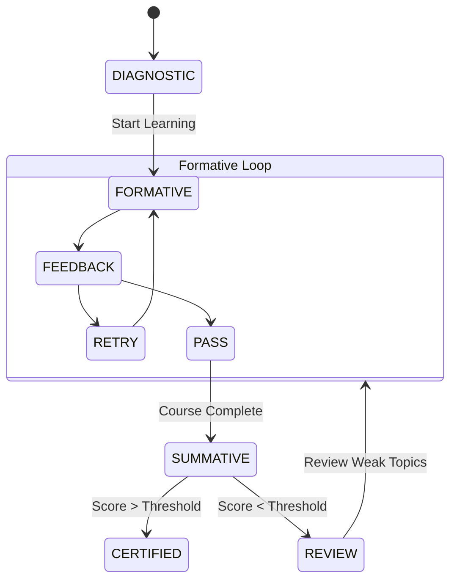

# Assessment Types Taxonomy

Tipologie di valutazione supportate.

## 1. Diagnostic (Placement)
- **Quando**: Inizio corso.
- **Scopo**: Definire il punto di partenza.
- **Formato**: Multipla scelta, ampia copertura, bassa profondità.
- **Impatto**: Configura il percorso (Adaptive).

## 2. Formative (Learning)
- **Quando**: Durante il modulo (end of topic).
- **Scopo**: Rinforzo e verifica comprensione immediata.
- **Formato**: Quiz brevi, Casi pratici guidati.
- **Impatto**: Feedback immediato, sblocco unità successiva.

## 3. Summative (Certification)
- **Quando**: Fine corso / Pre-esame.
- **Scopo**: Validazione competenza finale.
- **Formato**: Simulazione esame reale (tempo limitato, domande complesse).
- **Impatto**: Score finale, previsione voto esame.

## Lifecycle Diagram

