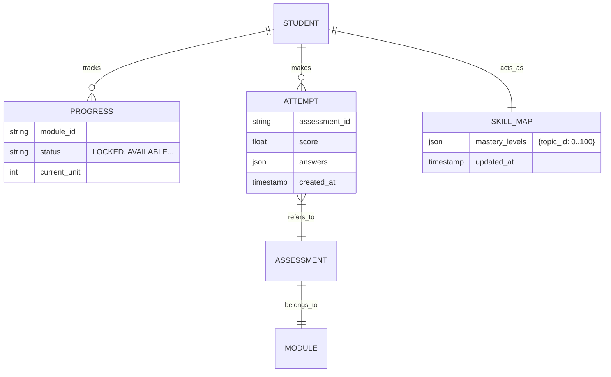

# Learning Data Model

Modello concettuale delle entità che supportano il Learning Engine.

## Entities
- **Student**: L'utente che apprende.
- **SkillMap**: Il profilo di competenza dello studente (Topic -> Mastery Level).
- **Attempt**: Il tentativo di superare un quiz/assessment.
- **Progress**: Lo stato di avanzamento nei moduli.

## ER Diagram (Conceptual)

