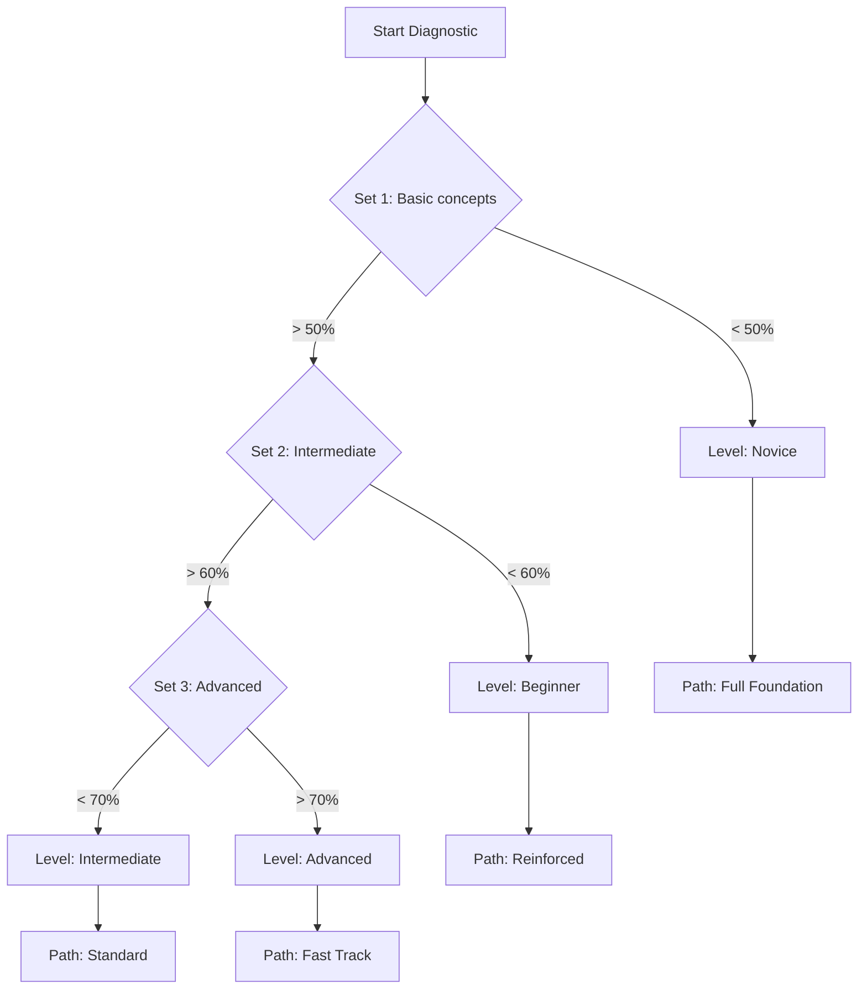

# Diagnostic Model

Il test d'ingresso per valutare il livello iniziale dello studente.

## Skill Mapping
Ogni domanda del test diagnostico è taggata con:
- **Topic**: Il modulo di riferimento (es. Contratti).
- **Competency**: Il Learning Objective (es. Distinguere Nullità vs Annullabilità).
- **Difficulty**: Facile / Medio / Difficile.

## Decision Tree

## Matrix: Score -> Path
| Score Range | Livello Assegnato | Configurazione Percorso |
|-------------|-------------------|-------------------------|
| 0-40% | **Novice** | Tutti i moduli obbligatori + Materiale extra. |
| 41-65% | **Beginner** | Tutti i moduli obbligatori. |
| 66-85% | **Intermediate** | Moduli base opzionali (se superati nel test). |
| 86-100% | **Advanced** | Accesso diretto alle simulazioni d'esame. |
