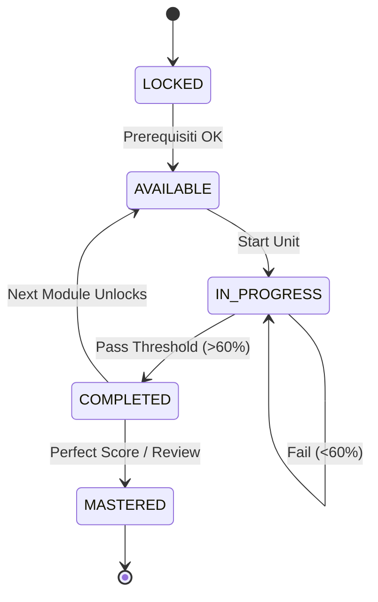

# Progression Logic

La macchina a stati che governa lo stato di ogni modulo per lo studente.

## Stati del Modulo
1.  **LOCKED**: Non accessibile (prerequisiti non soddisfatti).
2.  **AVAILABLE**: Accessibile, mai iniziato.
3.  **IN_PROGRESS**: Iniziato, non finito.
4.  **COMPLETED**: Tutti i requisiti soddisfatti (Quiz superati).
5.  **MASTERED**: Superato con eccellenza (> 90%).

## State Machine Diagram

## Failure Handling
- **Strike System**: Dopo 3 tentativi falliti sullo stesso quiz:
  1.  Blocco temporaneo (Cooldown 10m).
  2.  Obbligo di rilettura materiale.
  3.  Flag "Needs Help" per eventuale tutor umano (futuro).
