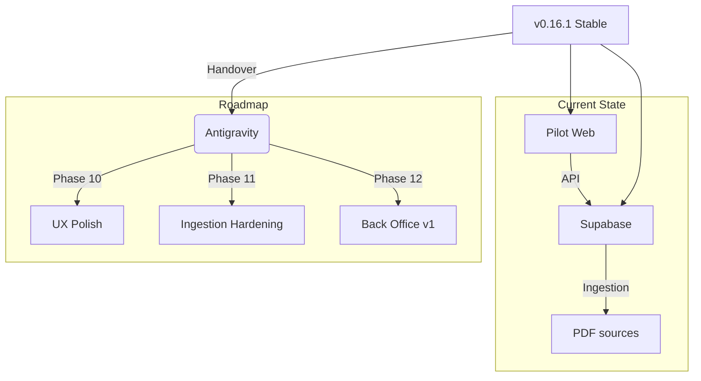

# HANDOVER MASTER — leuniversita-mvp (v0.16.1 baseline)

## Context Map

## 1) Stato attuale
- Baseline: v0.16.1
- Deploy: Vercel GREEN (root dir: `apps/pilot-web`)
- Supabase: Edge Functions attive + schema V2 in produzione
- End-to-end: smoke test remoto PASS su Production
  - Comando: `BASE_URL=https://leuniversita.vercel.app bash scripts/test/smoke_v2_remote.sh`

## 2) Architettura
### Frontend (apps/pilot-web)
- Next.js App Router
- API routes server-side come “gateway” verso Supabase
- SSR auth via `@supabase/ssr`
- UI: componenti in `components/`, types estratti in `types/`

### Backend (supabase)
- Postgres + migrations V2
- Edge Functions:
  - diagnostic-start, diagnostic-submit
  - study-plan
  - chat
  - adaptive-* (review / regenerate / update-skill-map)

### Ingestion (packages/ingestion)
- pipeline conversione/validazione contenuti
- runbooks e procedure in `docs/memory_bank/CONTENT` + `docs/runbook-ingestion.md`

## 3) Fix importanti già completati
- Singleton Supabase client per evitare Multiple GoTrueClient
- API hardening: cookie + bearer token
- Path fix /apikey header verso Edge Functions
- Fallback titoli moduli (API + UI + smoke test JSON validation)

## 4) Obiettivi di prodotto (prossimi step)
### Fase 10 — Stabilizzazione Pilot
- UX polish + gestione errori robusta
- standardizzazione 401/redirect
- microcopy IT

### Fase 11 — Contenuti e ingestion
- ingestion idempotente
- QA contenuti e provenienza
- comando unico “aggiungi corso”

### Fase 12 — Back Office v1 (priorità)
Back Office deve permettere (admin):
- creare corsi/esami/moduli
- caricare fonti
- avviare ingestion + vedere status/log
- pubblicare versioni (draft → reviewed → published)
- audit log

### Fase 13+ — Multi-esame, personalization, monetization, GTM
- espansione a più esami
- skill map cross-exam
- monetizzazione solo dopo stabilità
- pacchetto GTM (demo, onboarding, KPI dashboard)

## 5) Requisiti Back Office (v1)
- RBAC admin-only
- CRUD tassonomia (course/exam/module)
- gestione fonti con note licenza
- ingestion trigger + monitor
- workflow pubblicazione + rollback
- audit log (chi/cosa/quando)

## 6) Test & verifica
- Build:
  - `cd apps/pilot-web && npm ci && npm run build`
- Local smoke:
  - `bash scripts/test/smoke_v2.sh`
- Production smoke:
  - `BASE_URL=https://leuniversita.vercel.app bash scripts/test/smoke_v2_remote.sh`

## 7) Convenzioni operative
- PR piccoli e frequenti
- ogni PR: motivazione + verifica + rischio/rollback
- aggiornare Memory Bank:
  - CHANGELOG.md
  - TASK_LOG.md
  - report di fase in `_REPORTS/`

## 8) Output atteso dal team (Antigravity)
1) Roadmap aggiornata end-to-end (MVP → Pilot → Backoffice → GTM)
2) Specifica UX/contratti Backoffice v1
3) Implementazione incrementale Backoffice (skeleton → CRUD → upload+ingestion → publishing)
4) Report di chiusura per ogni fase
