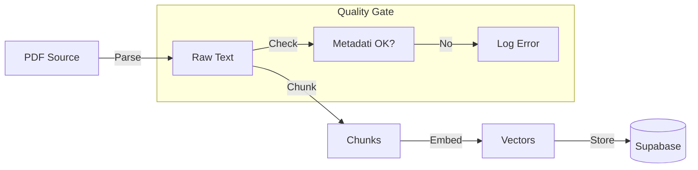
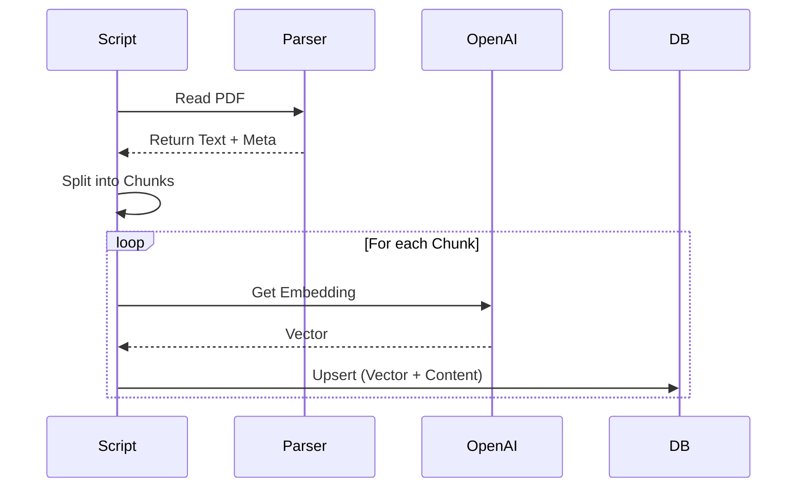

# Processo di Ingestione

## Cosa
Il processo automatizzato che trasforma documenti PDF grezzi in "conoscenza" interrogabile (vettori) nel database.

## Perché
Per garantire che il RAG risponda sempre con dati freschi, validati e correttamente citabili, senza intervento manuale eccessivo.

## Come
Lo script legge dai path configurati, parsa il contenuto, lo divide in chunk semantici, calcola gli embedding tramite OpenAI e salva su Supabase.

### Diagramma di Flusso


### Sequence Diagram


## Output / Deliverables
- Database popolato con vettori sincronizzati.
- Report di esecuzione in `docs/reports`.

## Esecuzione Operativa
Per lanciare la pipeline:

```bash
# Esecuzione Standard
npx dotenvx run -f packages/ingestion/.env -- npx ts-node packages/ingestion/src/run.ts

# In caso di errori ESM
npx dotenvx run -f packages/ingestion/.env -- npx ts-node --esm packages/ingestion/src/run.ts
```

### Verifica SQL
```sql
select count(*) from chunks where exam_id='diritto-privato';
```
