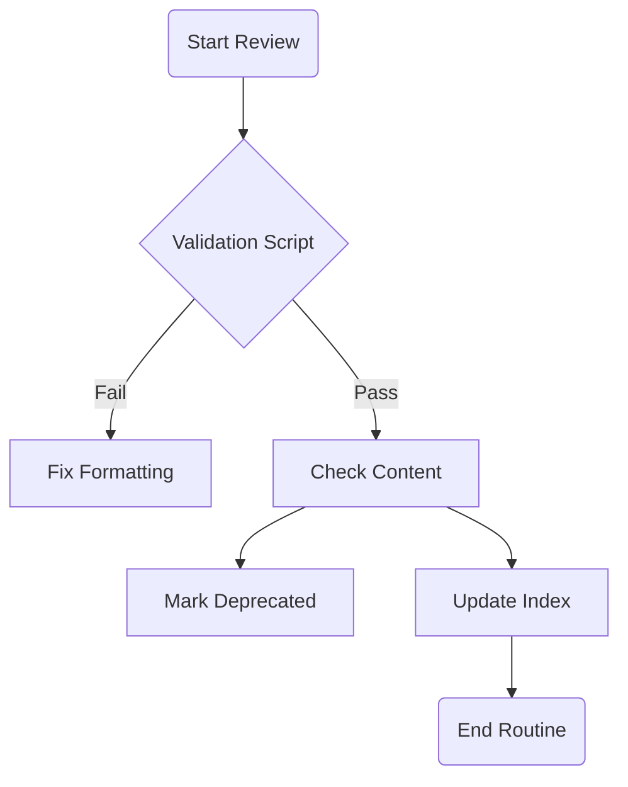

# Routine di Revisione Memoria

## Cosa
Un checkpoint settimanale (o post-milestone) per verificare la salute della `MEMORY_BANK`.

## Perché
La documentazione tende ad accumulare "debito tecnico" (file non aggiornati, link rotti, decisioni superate). Una pulizia regolare previene il degrado del contesto.

## Come
1.  **Run Validation**: Eseguire script di validazione.
2.  **Check Index**: Verificare che `INDEX.md` rifletta la realtà.
3.  **Deprecate**: Spostare o marcare come `status: deprecated` i file obsoleti.
4.  **Consolidate**: Unire appunti sparsi in documenti architetturali.

### Diagramma di Flusso

## Output / Deliverables
- `INDEX.md` aggiornato.
- File obsoleti rimossi o archiviati.
- Report di validazione verde.
