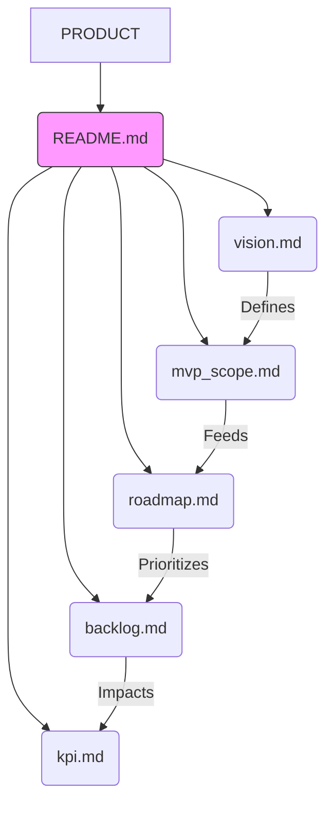

# Product Memory Bank

Questa sezione contiene la **Single Source of Truth** per la visione, la roadmap e i requisiti del prodotto "Le Università".
Nessuna specifica di prodotto deve esistere fuori da questa cartella.

## Mappa Documentale

## Indice dei File
| File | Scopo |
|------|-------|
| [`vision.md`](./vision.md) | Il "Perché" e il "Per chi". Problema, Soluzione e Valore. |
| [`mvp_scope.md`](./mvp_scope.md) | Il "Cosa" (e cosa no). Confini esatti dell'MVP. |
| [`roadmap.md`](./roadmap.md) | Il "Quando". Timeline macroscopica e fasi. |
| [`backlog.md`](./backlog.md) | Il "Dettaglio". Epiche e Storie prioritarie. |
| [`kpi.md`](./kpi.md) | Il "Successo". Metriche da monitorare. |
