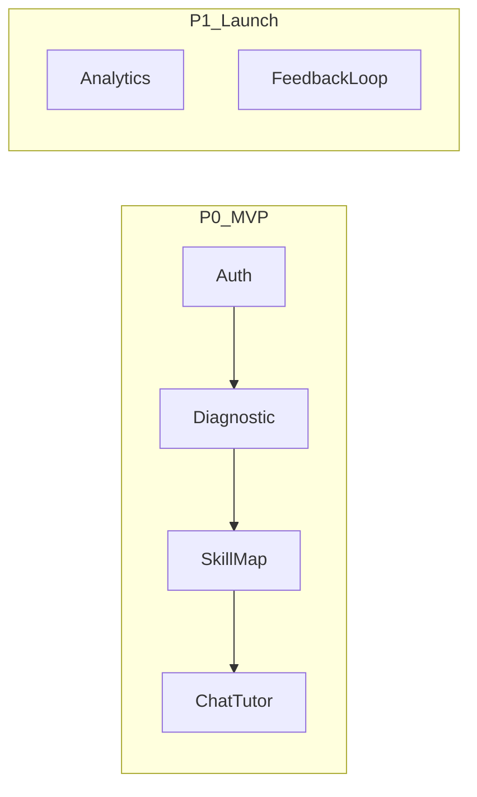

# Product Backlog

## Epiche (Priorità P0 - MVP)

### E1: Core Ingestion (Done)
- Framework per parsing PDF e vettorializzazione.
- [x] Script TypeScript ingestion.
- [x] Database Supabase pgvector.

### E2: Diagnostica
- Sistema per valutare livello iniziale studente.
- [ ] Quiz Generation (Backend).
- [ ] UI Test Player (Frontend).
- [ ] Risultati e Skill Map (Fullstack).

### E3: RAG Tutor
- Chat intelligente guidata dai documenti.
- [ ] Chat UI streaming.
- [ ] Citazioni cliccabili.
- [ ] Guardrails (niente OT).

### E4: Auth & Profile
- Gestione utente minima.
- [ ] Supabase Auth UI.
- [ ] Pagina Profilo.

## WorkflowPriorità

## Kanban Logico
| ID | Titolo | Prio | Stato |
|----|--------|------|-------|
| US-01 | Login Studente | P0 | To Do |
| US-02 | Quiz Diagnostico 10 domande | P0 | Doing |
| US-03 | Chat con fonti | P0 | Done |
| US-04 | Dashboard Professore | P1 | Backlog |
