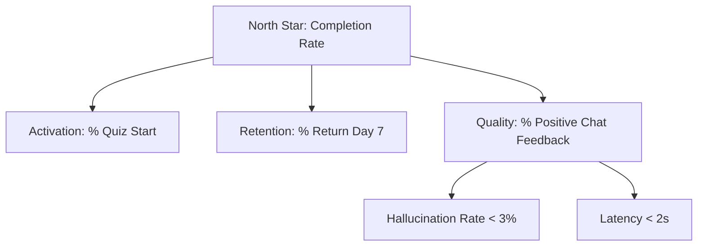

# KPIs & Metrics

Metriche per valutare il successo del Pilot.

## North Star Metric
# **% Studenti che completano il percorso pre-esame**
(Indica valore reale percepito).

## KPI Albero

## Metriche MVP (Target)
| Metrica | Descrizione | Target Pilot |
|---------|-------------|--------------|
| **Signups** | Numero account creati | 50 (Closed Beta) |
| **Engagement** | Msg scambiati per utente | > 20 / sessione |
| **Accuracy** | Voto medio risposta AI (1-5) | > 4.2 |
| **Performance** | Tempo risposta chat (TTFB) | < 1.5s |
