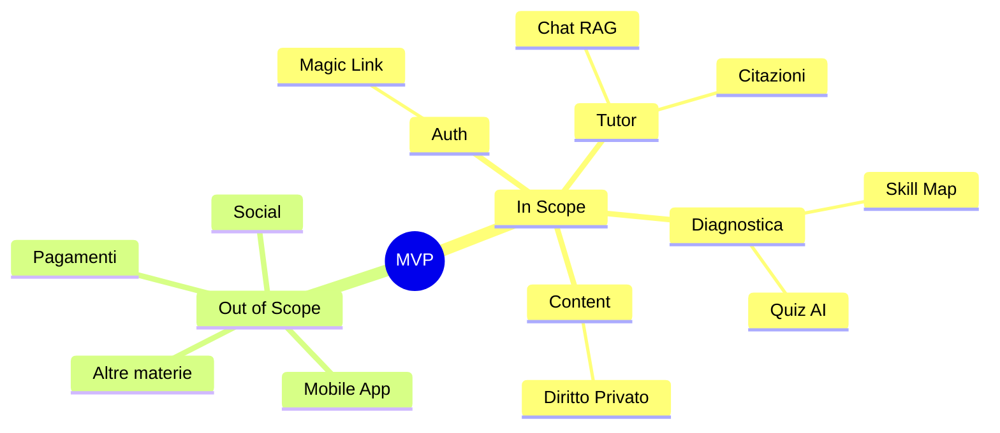

# MVP Scope

Definizione del perimetro per il lancio ("Pilot").

## In Scope (Incluso)
1.  **Materia Unica**: Diritto Privato.
2.  **Valutazione Iniziale (Diagnostica)**:
    - Quiz a risposta multipla generati da AI.
    - Analisi gap (Skill Map).
3.  **Chat Tutor**:
    - RAG su manuali caricati.
    - Citazioni obbligatorie delle fonti.
4.  **Auth**:
    - Login/Signup (Magic Link Supabase).
    - Profilo studente base.

## Out of Scope (Escluso per ora)
- Altre materie (Diritto Pubblico, ecc.).
- App Mobile nativa (solo Web Responsive).
- Pagamenti/Abbonamenti (Pilot gratuito/demo).
- Integrazione LMS dell'ateneo (Moodle, Blackboard).
- Social features (amici, classifiche).

## Assunzioni
- Gli studenti hanno accesso a dispositivi web.
- I PDF dei manuali sono forniti e liberi da DRM restrittivi per l'ingestione.

## Feature Map

