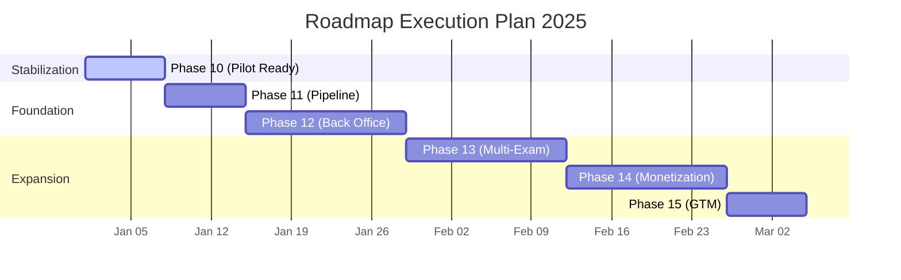

# Product Roadmap

This roadmap defines the path from "Technical MVP" to "Go-To-Market Ready Platform". It is structured in sequential Execution Phases.

## Phases Breakdown

### **Phase 10: Product Stabilization (Pilot Readiness) [NOW]**
**Goal**: Make user flows robust, demoable, and polished for real users.
- [ ] UX Polish (Loading, Empty, Error states, 401 handling).
- [ ] Consistent Italian microcopy.
- [ ] Minimal non-invasive analytics.
- **Acceptance**:
    - Build & Smoke tests pass (Local & Remote).
    - End-to-end user flow verified (Login -> Diagnostic -> Plan -> Results).

### **Phase 11: Content Pipeline Hardening**
**Goal**: Ensure ingestion is repeatable, safe, and scalable.
- [ ] Idempotent ingestion pipeline verification.
- [ ] Content QA (Metadata validation, reference checks).
- [ ] One-command ingestion scripts.
- **Acceptance**:
    - "Diritto Privato" fully consistent.
    - Full content provenance tracking.

### **Phase 12: Back Office v1 (Admin Console)**
**Goal**: Internal operations for course management without developer intervention.
- [ ] RBAC (Role-Based Access Control) for Admin areas.
- [ ] Course/Exam/Module CRUD.
- [ ] Source Upload & Ingestion triggering.
- [ ] Publishing Workflow (Draft -> Published).
- **Acceptance**:
    - Admin can create a course from scratch.
    - Admin can upload sources and see them ingested.

### **Phase 13: Multi-Exam & Personalization**
**Goal**: Support multiple exams and continuous skill tracking.
- [ ] Exam Selector UI.
- [ ] Skill Map visualization.
- [ ] Cross-exam progression logic.
- **Acceptance**:
    - Users can switch exams retaining profile integrity.

### **Phase 14: Monetization & Access Matrix**
**Goal**: Implement business model gates.
- [ ] Access Tiers (Free vs Premium).
- [ ] Payment Integration foundation.
- **Acceptance**:
    - Feature gating works without data leakage.

### **Phase 15: Go-To-Market (GTM) Package**
**Goal**: Sales-ready assets and onboarding process.
- [ ] Institutional Demo Script.
- [ ] KPI Dashboard for Admins/Partners.
- [ ] Onboarding Runbooks.
- **Acceptance**:
    - Documented process to onboard a new university intuition.

## Timeline Overview

