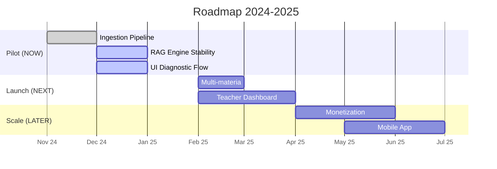

# Product Roadmap

## Fasi Macro

### NOW (Q4 2024 - Gen 2025) - Pilot
- Focus: Stabilità tecnica e feedback qualitativo.
- Deliverable: MVP funzionante per Diritto Privato.
- Utenti: Beta tester chiusi.

### NEXT (Q1 2025) - V1 Launch
- Focus: Retention e scalabilità contenuti.
- Deliverable: Aggiunta Diritto Pubblico + Dashboard Docente.
- Utenti: Primi atenei partner.

### LATER (Q2 2025+) - Expansion
- Focus: Monetizzazione e Gamification.
- Deliverable: Premium Plan, Mobile App.

## Timeline Grafica

