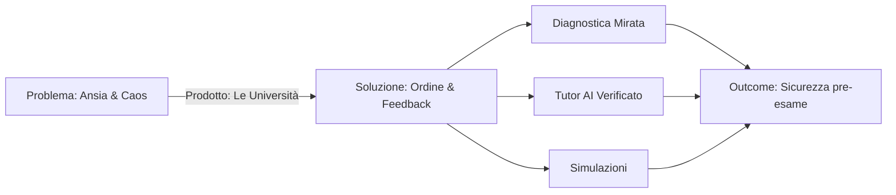

# Product Vision

## Il Problema
Gli studenti universitari (specie in Giurisprudenza) affrontano una mole di studio enorme con strumenti obsoleti (libri statici, appunti sparsi).
- **Ansia da esame**: Non sanno se sono pronti.
- **Dispersione**: Trovano difficile collegare concetti complessi.
- **Feedback Lento**: Devono aspettare l'esame per sapere se hanno capito.

## La Soluzione
**Le Università** è una piattaforma di apprendimento adattivo potenziata dall'AI.
Non sostituisce lo studio, lo rende efficiente.
Fornisce:
1.  **Diagnostica**: "Cosa sai e cosa ti manca".
2.  **Tutor H24**: Chat RAG su fonti verificate (Diritto Privato).
3.  **Simulazione**: Test realistici pre-esame.

## Target Audience
**Primario**: Università ed Enti Formativi (B2B2C).
**Utente Finale**: Studente universitario (inizialmente Giurisprudenza).

## Cosa NON siamo
- Non siamo un "risolutore di compiti" (Cheat tool).
- Non siamo un sostituto del Professore o del Libro di testo.
- Non siamo una community social (no forum/chat tra studenti per ora).

## Value Map

