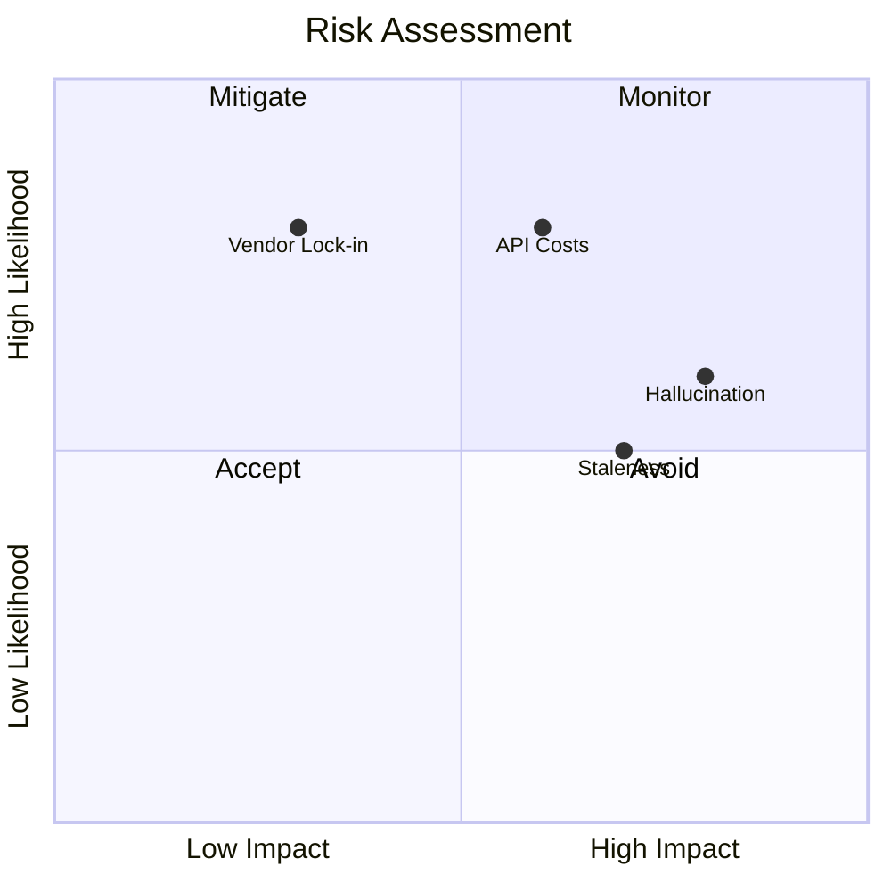

# Risks Register

### Visual Risk Matrix

| ID | Description | Likelihood | Impact | Mitigation | Status |
| ID | Description | Likelihood | Impact | Mitigation | Status |
|----|-------------|------------|--------|------------|--------|
| R-001 | **Model Hallucination**: The AI might provide incorrect answers not supported by the documents. | Medium | High | Strict prompting ("answer only from context"), citation verification, and low temperature settings. | Active |
| R-002 | **API & Token Costs**: OpenAI usage for ingestion and chat might exceed budget. | High | Medium | Implement caching, usage tracking, and rate limiting in Edge Functions. | Monitored |
| R-003 | **Data Staleness**: University regulations change, rendering the KB obsolete. | Medium | High | Automated ingestion pipelines and versioning of source documents. | Planned |
| R-004 | **Vendor Lock-in**: Heavy reliance on Supabase proprietary features (Edge Functions, Auth). | High | Low | Acceptable trade-off for MVP speed. | Accepted |
