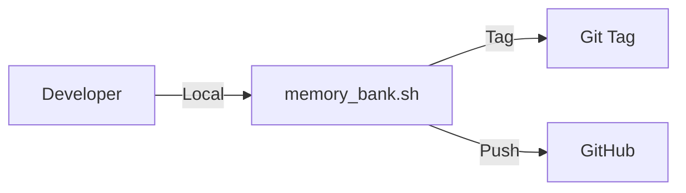

# Runbooks

### Release Flow



## MEMORY_BANK Process
See `scripts/memory_bank.sh`.

### How to release manually
```bash
./scripts/memory_bank.sh --type <patch|minor|major> --comment "Release description"
```

## Local Development
### Run Server
The web application (`pilot-web`) can be launched globally:
```bash
run_server
```
Alternatively:
```bash
./scripts/run_server.sh
```

## Verification (V2)
- **Artifact Check**: `npm run verify:v2` (Checks for required files)
- **Smoke Test**: 
  1. Ensure server is running (`run_server`)
  2. `./scripts/test/smoke_v2.sh`

