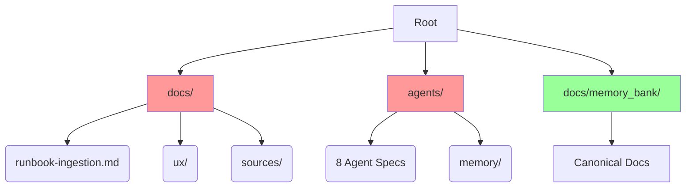
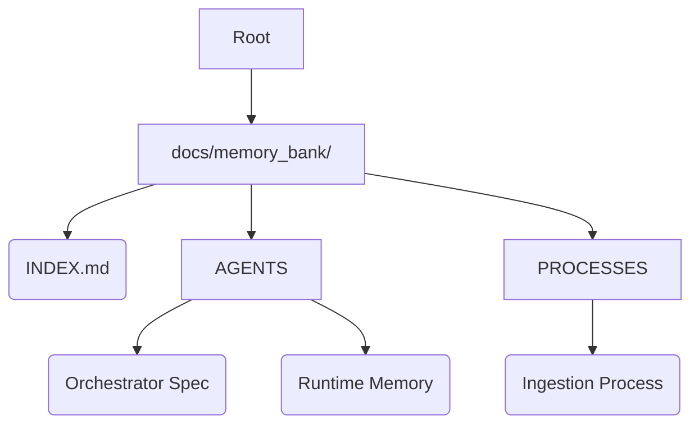

# Repo Memory Audit

## Current State Map
Oggi la documentazione vive in tre luoghi principali, creando frammentazione.

## Duplicazioni e Conflitti
1.  **Ingestion Runbook**: `docs/runbook-ingestion.md` esiste fuori, mentre `docs/memory_bank/PROCESSES/ingestion.md` è il nuovo canonico.
2.  **Agent Specs**: Le specifiche (`ORCHESTRATOR_PM.md`, ecc.) sono in `agents/`, fuori dal Memory Bank.
3.  **Agent Memory**: `agents/memory/` contiene contesto che dovrebbe stare in `docs/memory_bank/AGENTS/`.

## Link Rotti (INDEX.md)
- `AGENTS/` -> Cartella non esiste ancora.
- `PRODUCT/` -> Cartella non esiste ancora.
- `CONTENT/` -> Cartella non esiste ancora.

## Piano di Azione (Phase 1)
1.  **Struttura**: Creare cartelle mancanti.
2.  **Migrazione Agenti**: Portare le specifiche in `docs/memory_bank/AGENTS` con Mermaid.
3.  **Unificazone Memoria**: Creare `AGENTS/_runtime_memory.md` per loggare i task.
4.  **Runbook Normalization**: Deprecare `docs/runbook-ingestion.md` in favore del Process canonico.

## Target State

