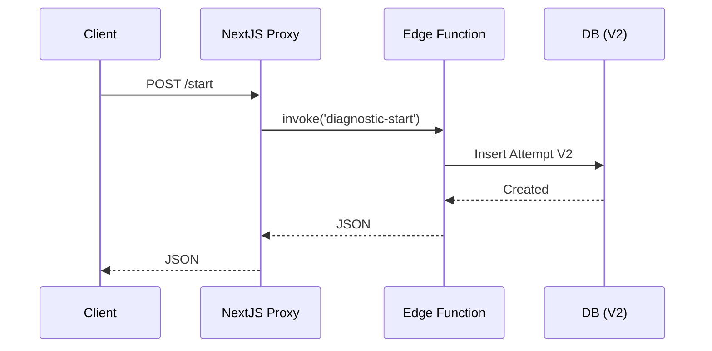

# v0.12.2 Smoke Test Checklist

Checklist per validare l'implementazione di Schema V2 e API Proxy.

## 1. Database & Seed
- [ ] Database migrated con `20251219...schema_v2.sql` (Tables `learning_attempts_v2`, `learning_progress_v2` created).
- [ ] Seed eseguito (`scripts/seed/schema_v2_seed.sql`).
- [ ] Tabella `assessments` contiene almeno 1 record 'diagnostic'.
- [ ] Tabella `questions` contiene domande collegate.

## 2. API Endpoints
### POST /api/diagnostic/start
- [ ] **Request**: `{ "courseId": "..." }`
- [ ] **Response 200**: `{ "attemptId": "...", "questions": [...] }`
- [ ] **Verify**: Record creato in `learning_attempts_v2`.

### POST /api/diagnostic/submit
- [ ] **Request**: `{ "attemptId": "...", "answers": [...] }`
- [ ] **Response 200**: `{ "score": ..., "placementLevel": "...", "planId": "..." }`
- [ ] **Verify**: Record creato in `learning_answers_v2`, Attempt status 'completed', Plan creato in `learning_plans`.

### GET /api/plan/current
- [ ] **Request**: `?courseId=...`
- [ ] **Response 200**: `{ "planId": "...", "level": "..." }`

### GET /api/progress
- [ ] **Request**: `?courseId=...`
- [ ] **Response 200**: `{ "modules": [...] }`

## 3. Sequence Validated

