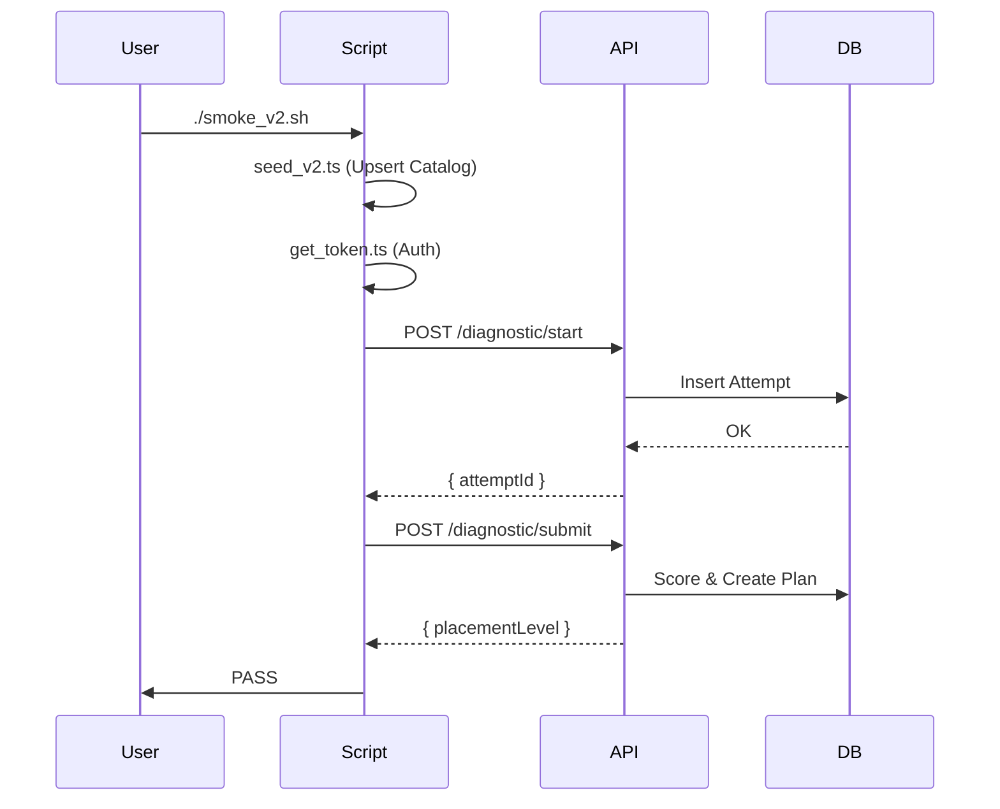

# v0.12.2 Smoke Test Results

**Status**: 🔴 BLOCKED
**Blocker**: Missing `DATABASE_URL` or `supabase` CLI to apply V2 Migration.

## Environment
- **OS**: Mac
- **Node**: v22
- **Env Vars**: `SUPABASE_URL`, `SUPABASE_SERVICE_ROLE_KEY` (Present)
- **Missing**: `DATABASE_URL` or `supabase` CLI.

## Test Artifacts Created
The following scripts have been created to automate testing once the environment is fixed:
1. `scripts/test/seed_v2.ts`: Populates V2 Catalog (Courses, Modules, Questions).
2. `scripts/test/get_token.ts`: Acquires Auth Token for test user.
3. `scripts/test/smoke_v2.ts`: Main runner (Start -> Submit -> Plan -> Progress).
4. `scripts/test/smoke_v2.sh`: Wrapper script.

## Execution Log
1. **Server Start**: ✅ `npm run dev` started on localhost:3000.
2. **Seed**: ❌ FAILED.
   ```
   code: 'PGRST205',
   message: "Could not find the table 'public.courses' in the schema cache"
   ```
   *Cause*: The SQL Migration `20251221000000_schema_v2.sql` has not been applied to the database.

## Resolution Required
To proceed, an Administrator must apply the pending migration:
```bash
supabase db push
# OR if using psql
psql $DATABASE_URL -f supabase/migrations/20251221000000_schema_v2.sql
```

Once applied, run:
```bash
./scripts/test/smoke_v2.sh
```

## Expected Results
Once unblocked, the test should produce:
- `scripts/test/out/start.json`: Diagnostic Attempt ID.
- `scripts/test/out/submit.json`: Placement Level & Plan ID.
- `scripts/test/out/progress.json`: Module Status.

## Sequence (Planned)

