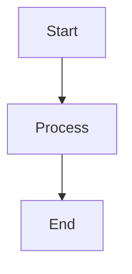

# [Title]

## Cosa
[Descrizione sintetica dell'obiettivo o contenuto]

## Perché
[Motivazione e contesto]

## Come
[Dettagli implementativi o operativi]

### Diagramma
<!-- MERMAID: required unless mermaid: "not_applicable" in front-matter -->

## Output / Deliverables
- [Un elenco degli output tangibili]
